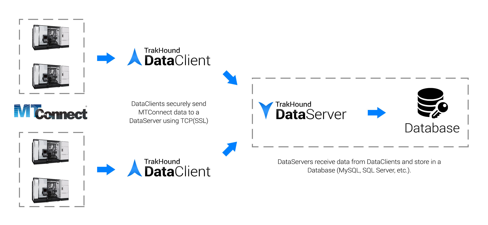

 
 
TrakHound Data Server is used to receive MTConnect® data streamed from TrakHound Data Clients and store that data in a database.

TrakHound DataClient and DataServer are designed specifically to store MTConnect® data in a database. Nearly all MTConnect data is stored with its original terminology in database tables for data storage or to use with cloud applications. 

# TrakHound
The TrakHound DataClient and DataServer applications provide the manufacturing community with a Free and Open Source alternative so anyone can start collecting valuable machine data that can be used to analyze and improve future production in the upcoming years that will dominated by the IIoT. TrakHound provides you the tools to collect MTConnect data in near raw form and to store that data for later use. Even if you don't see the need for this data now, you may in several years and will wish you had previous year's data to compare. **Take the steps today to prepare for tomorrow and get started with IIoT with TrakHound!**

# Features
- Automatically finds and configures MTConnect devices on a network
- Data filtering with triggers to collect all data or only what is needed
- Ability to send data to multiple TrakHound DataServers to create data redundancy or to meet data security requirements (local vs cloud)
- Utitlizes streaming connections for both MTConnect and connections to TrakHound DataServers
- Supports SSL(TLS) for sending data to TrakHound DataServers
- Non-volatile buffering to retain collected data between connection interruptions

### Data Storage
**MTConnect Agents by themselves are not storage applications.** This is made clear in the MTConnect Standard. Instead the purpose of MTConnect Agents is to serve data to client applications when requested. While the Agent does keep a small buffer, this buffer is not intended to be used for data storage but rather to retain data between connection interruptions. TrakHound fulfills the role of requesting this data and then storing it in a database for permanant storage. Data is stored which can then be accessed by other TrakHound applications, ERP/MES systems, third party software, or by reading the database directly using software such as Microsoft Access.

### Cloud Applications
Although the MTConnect Agent is a server application itself, most situations require Incoming connections where the application accesses the Agent directly which requires firewall exceptions and since many Agents run on the machine contol itself this would mean each machine would need to accessible from outside networks (usually undesirable for security reasons). TrakHound solves this issue by centralizing the data onto a single server which can either be accessed using the TrakHound API over HTTP/HTTPS or directly to the database itself. Since all of the MTConnect data is now **Outgoing** as opposed to Incoming, machine controls can stay isolated from external networks while a single DataServer accepts incoming requests.

### Security
One of the main goals of TrakHound is to provide tools to securely collect data so that no matter what restrictions your industry requires, you can still benefit from data analysis to improve your manufacturing processes. TrakHound fully supports SSL(TLS) encrypted connections for the DataClient -> DataServer connections as well as the API access. When used with a trusted SSL Certificate, data is sent securely just as online banking/payments are sent. 

By centralizing the point where data is accessed, TrakHound also allows internal machine networks to stay isolated from external networks to prevent both unauthorized data access and possible viruses from effecting the machine controls themselves.

Each TrakHound DataClient can also filter data to only send specific data to certain DataServers. This can be used to only send status data to a cloud server used for machine status monitoring, while sending ALL data to a secure onsite server. 

Of course, the biggest security benefit to using TrakHound is that it is Open Source and the source code can be reviewed to insure exactly what data is being collected and to make sure that no other data is being sent anywhere it shouldn't be.

